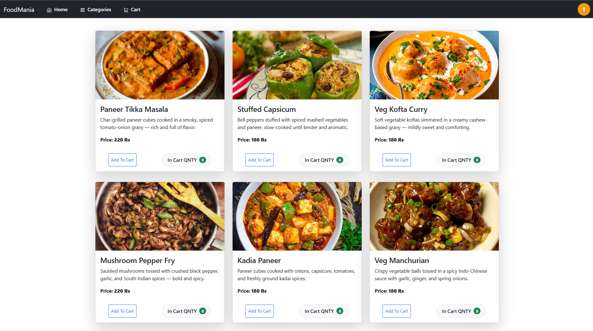
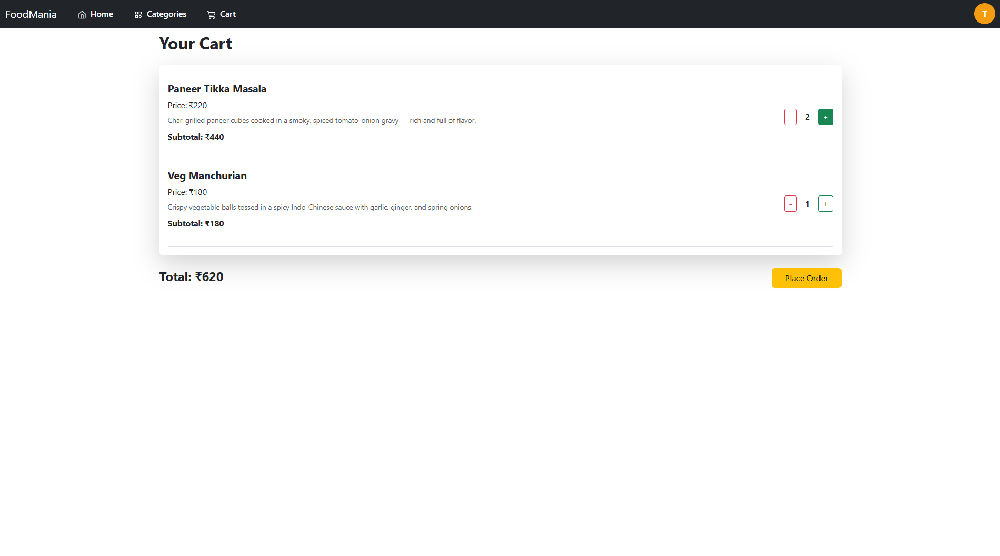
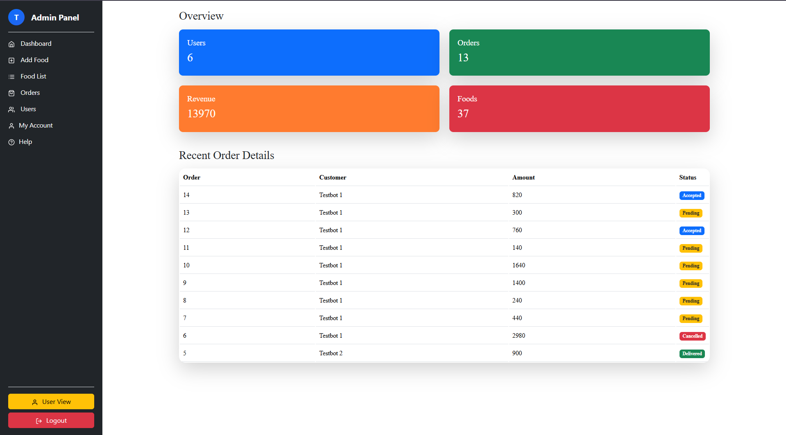
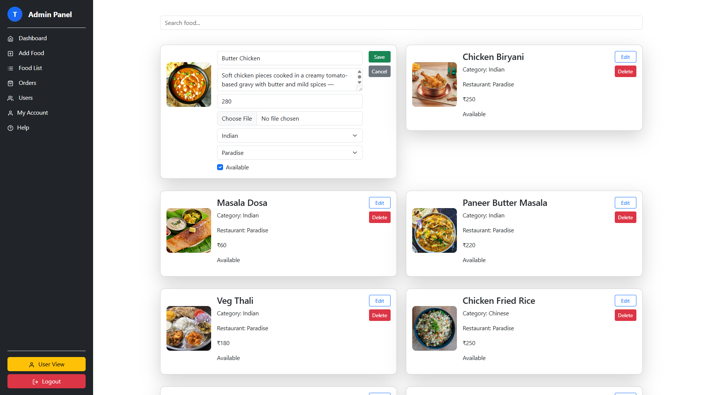
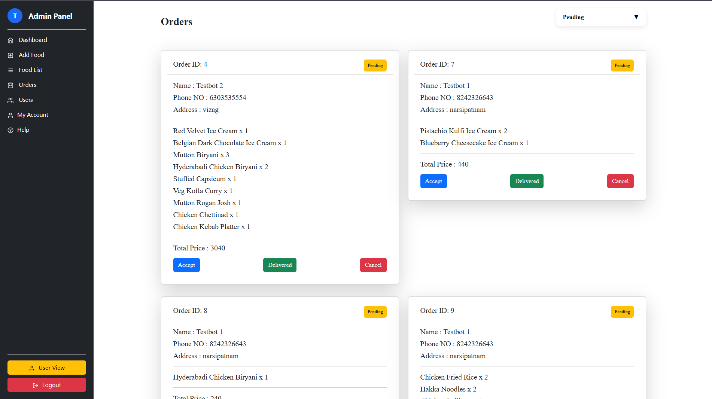
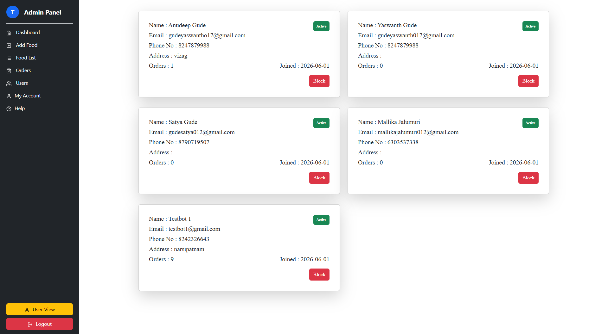

# 🍽️ FoodMania

A full-stack online food ordering platform developed using **React**, **Spring Boot**, **Spring Security**, **JWT Authentication**, and **MySQL**. The application enables users to browse food items, place orders, manage carts, and securely access features through role-based authentication.

The project follows a RESTful architecture with a React frontend and a Spring Boot backend, providing a complete food ordering experience for both customers and administrators.

## Features

### User Features

- User Registration
- Secure Login using JWT Authentication
- View Food Categories
- Browse Food Items
- Add Food Items to Cart
- Update Cart Quantity
- Remove Items from Cart
- Place Orders
- View Order History
- Edit User Profile

### Admin Features

- Admin Login
- Add Food Items
- Update Food Items
- Delete Food Items
- Manage Categories
- Manage Restaurants
- View Registered Users
- Block / Unblock Users
- View Customer Orders
- Dashboard Statistics

### Security Features

- Password Encryption using BCrypt
- JWT Token Generation
- JWT Token Validation
- Stateless Authentication
- Protected REST APIs
- Role-Based Authorization

## Tech Stack

### Frontend

- React.js
- JavaScript (ES6)
- Bootstrap
- HTML5
- CSS3

### Backend

- Java
- Spring Boot
- Spring Security
- Spring Data JPA
- Hibernate
- JWT (JSON Web Token)

### Database

- MySQL

### Development Tools

- IntelliJ IDEA
- Visual Studio Code
- Postman
- Git
- GitHub

## Project Structure

```
FoodMania
│
├── backend
│   ├── config
│   ├── controllers
│   ├── dto
│   ├── models
│   ├── repo
│   ├── security
│   ├── service
│   └── resources
│
├── frontend
│   ├── public
│   └── src
│       ├── components
│       ├── assets
│       └── data
│
└── README.md
```

## Installation

### Clone Repository

```bash
git clone https://github.com/YOUR_USERNAME/FoodMania.git
```

### Backend Setup

```bash
cd backend
```

1. Copy

```
application-example.properties
```

to

```
application.properties
```

2. Update

- Database URL
- Database Username
- Database Password
- JWT Secret

3. Run the Spring Boot application.

---

### Frontend Setup

```bash
cd frontend
npm install
npm start
```

The frontend will run on:

```
http://localhost:3000
```

## Configuration

Create an `application.properties` file from `application-example.properties` and configure:

```properties
spring.datasource.url=
spring.datasource.username=
spring.datasource.password=

jwt.secret=
jwt.expiration=
```

## JWT Authentication

The application uses Spring Security with JWT-based authentication.

### Authentication Flow

1. User logs in with email and password.
2. Credentials are validated.
3. Password is verified using BCrypt.
4. A JWT token is generated.
5. The token is returned to the frontend.
6. The frontend stores the JWT.
7. Protected API requests include:

```
Authorization: Bearer <JWT_TOKEN>
```

8. The backend validates the token using `JwtAuthenticationFilter`.
9. If the token is valid, access is granted to protected resources.

## REST API

### Authentication

| Method | Endpoint |
|---------|----------|
| POST | /api/users/register |
| POST | /api/users/login |

### Food

| Method | Endpoint |
|---------|----------|
| GET | /api/fooditems |
| POST | /api/fooditems |
| PUT | /api/fooditems/{id} |
| DELETE | /api/fooditems/{id} |

### Categories

| Method | Endpoint |
|---------|----------|
| GET | /api/categories |
| POST | /api/categories |

### Cart

| Method | Endpoint |
|---------|----------|
| GET | /api/cart |
| POST | /api/cartitems |

### Orders

| Method | Endpoint |
|---------|----------|
| POST | /api/orders |
| GET | /api/orders |


## Aplication ScreenShots 

### Home Page


### Food-Menu Page



### Cart Page


### Adimin-Dashboard Page


### Food-List Page


### Orders Page


### Users Page


## Author

**Gude Yaswanth**

- GitHub: https://github.com/YaswanthGude-cmd
- LinkedIn: https://www.linkedin.com/in/yaswanth-gude-50813b322/

